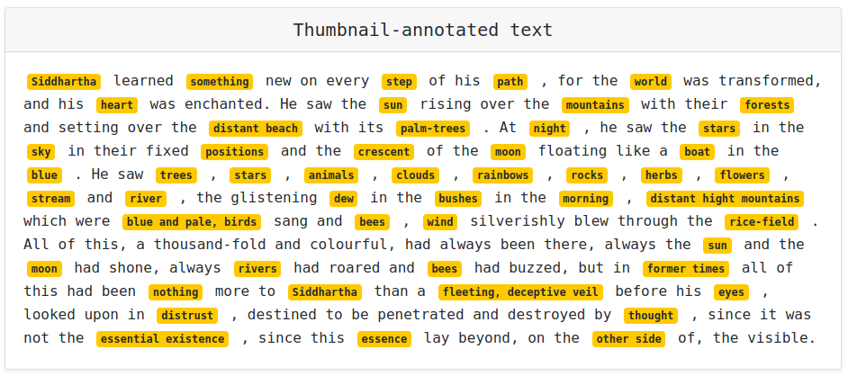
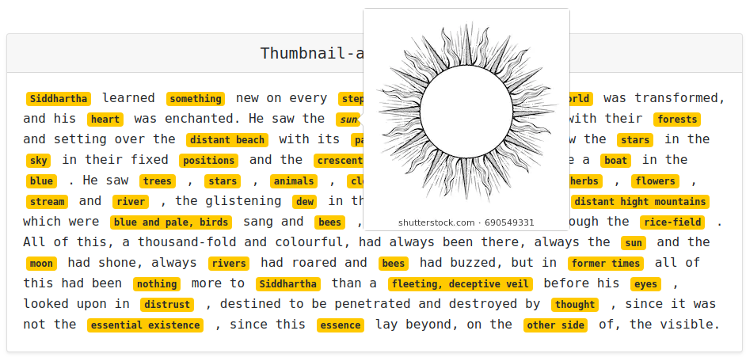
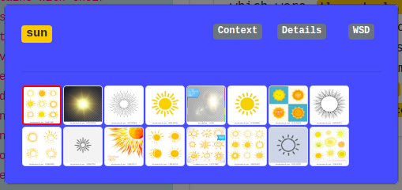
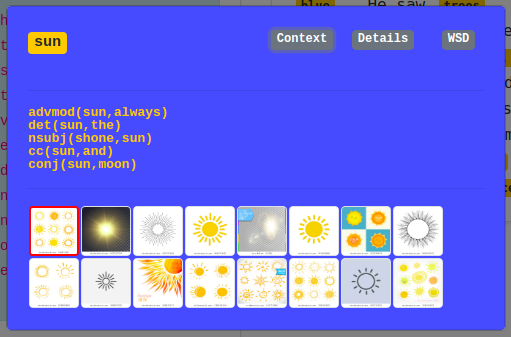
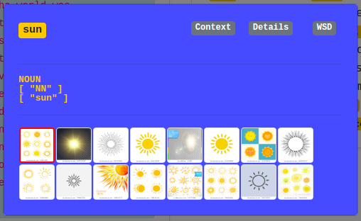
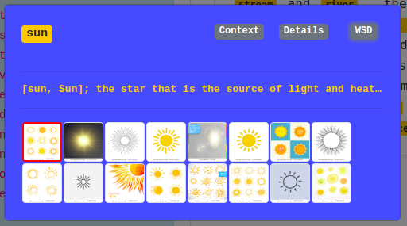
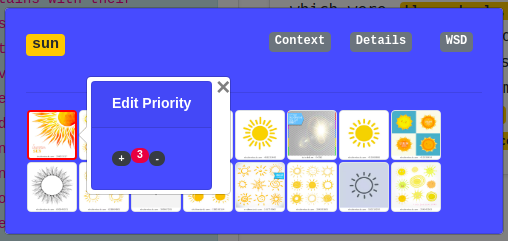

# User Guide
This guide will show you how to interact with the Web-Frontend as a User.

### Textinput area

### Thumbnail-annotated text
Here each CaptionToken is highlighted in yellow

### Image slide of all crawled Thumbnails
Shows up by hovering a CaptionToken.

### CaptionToken modal with all crawled Thumbnails and buttons to show more information about Details, Context and WordSenseDisambiguation
Shows up by clicking on a CaptionToken.

### Context Information with Universal Dependencies
By clicking the Context button.

### POS and Token Information
By clicking the Details button.

### Word Sense Disambiguation from WordNet 3.0
By clicking the WSD button. Hover the sense(s) to get the full description.

### Enlarged Thumbnail
By hovering a Thumbnail.

### Edit the Thumbnail Priority
By clicking on a Thumbnail. The Thumbnail with the highest priority is bordered in red and shows up first in the list.

